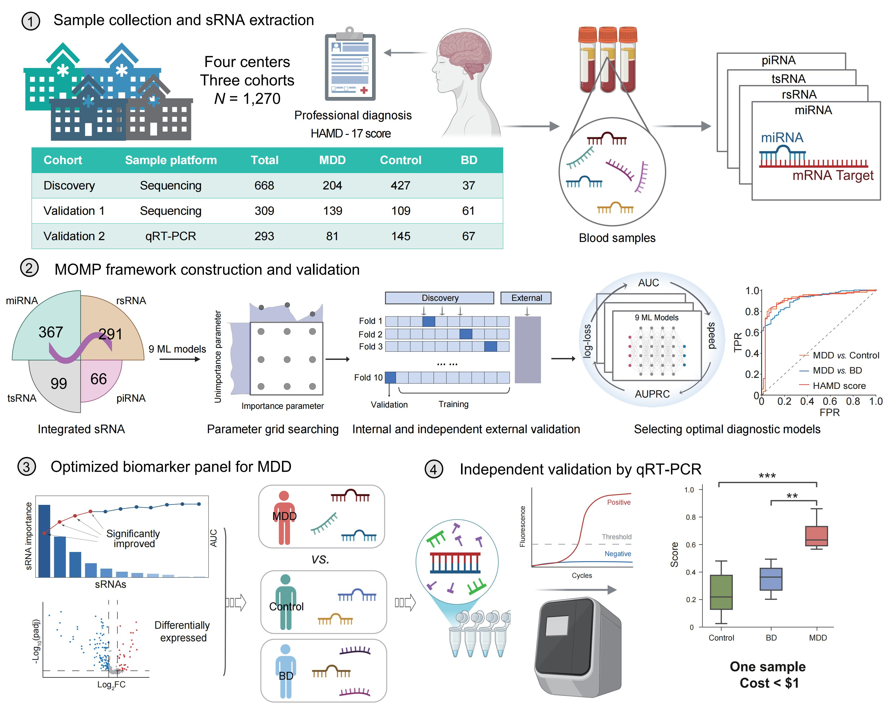

# 🧠 sRNA-MDD-Diagnostic

This repository implements the full analysis pipeline from our study:  
**"Circulating Small RNA Signature for Diagnosis of Major Depressive Disorder"**,  
mainly including sRNA expression processing, statistical analysis, HAMD-17 severity prediction, and multi-objective model prioritization (MOMP)-based classifier design.

   


## Project Structure
```
sRNA-MDD-diagnosis/
├── Scripts & Notebooks/                    # Python scripts, Jupyter notebooks or markdown for analysis
│   ├── Preprocessing/                      # Sequence alignment, annotation, and quality control filtering
│   ├── Differential expression/            # MDD vs. other groups
│   ├── HAMD regression/                    # Spearman correlation and HAMD-17 prediction modeling via Elastic net regression 
│   ├── MOMP modeling/                      # MOMP framework
│   ├── Feature selection/                  # Establishment of optimized circulating sRNA panel
│   ├── RT-qPCR validation/                 # Diagnostic scoring
│   ├── Network and pathway analysis/       # Pathway enrichment and visualization
├── Sample results/                         # Sample output files, figures, or tables
├── References/                   # Literature and tool citations
├── README.md                     # Project overview
├── Requirements.txt              # Python dependencies (via pip)
└── Environment.md                # Full software environment (including R/tools)
```

## Pipeline Summary

### 1. **Small RNA Preprocessing**
- Adapter trimming, quality filtering
- Mapping to known databases: miRBase, GtRNAdb, the rRNA database from NCBI, piRBase
- Normalization and filtering

### 2. **Differential Expression Analysis**
- Mann–Whitney U test
- FDR correction (Benjamini-Hochberg)
- FC > 1.5 or < 0.67, adjusted p < 0.05

### 3. **Enrichment Analysis**
- Predicted target genes of sRNAs  
- GO enrichment analysis  
- KEGG pathway analysis  

### 4. **Correlation and HAMD Prediction**
- Spearman correlation with HAMD-17
- Elastic Net regression (cross-validated α, λ selection)
- Bootstrap-based feature stability assessment

### 4. **MOMP framework**
- Classification tasks:
  - MDD vs. Control
  - MDD vs. BD
  - MDD severity stratification (HAMD-17 ≥ 17)
- 9 ML algorithms: Random Forest, SVM, XGBoost, LightGBM, CatBoost, MLP, AdaBoost, Logistic Regression, GBDT
- Cross-validation and external validation 
- NSGA-III optimization
- Feature interpretation

### 5. **Feature Selection**
- Hierarchical clustering to reduce multicollinearity
- Feature gain + SHAP impact ranking
- Sequential forward selection + DeLong test

### 6. **RT-qPCR Validation**
- Diagnostic scoring for MDD

### 7. **Network and Pathway Analysis**
- miRanda + RNAhybrid for target prediction
- GO and KEGG enrichment
- Cytoscape network visualization
---


## How to use

0. Prerequisites  
Ensure you have conda installed. Then set up the Python environment:  
```bash
conda create -n mdd-srna python=3.11
conda activate mdd-srna
pip install -r requirements.txt
```
For R-based scripts, please install R version ≥ 4.4.1 and required packages (see environment.md).  

1. Run Python Scripts
```bash
# Example: Calculate fold-change (FC) between MDD and comparison groups based on median expression values:
python median_mirna.py mirna.csv median.csv
```
2. Jupyter Notebooks
   Launch Jupyter in the activated environment.
   
3. Other Scripts: R or Markdown Scripts

## Requirements
See requirements.txt for a full list. Key packages include:  

* numpy, pandas, scikit-learn, shap, pymoo

* ML libraries: xgboost, lightgbm, catboost

* Plotting: seaborn, matplotlib


## Environment.md

Other dependencies include:  

* R (e.g. sva)  

* External tools: miRanda, RNAhybrid, Cytoscape   

See environment.md for full details.  

## References
- See `references/` for cited software tools and relevant papers.
